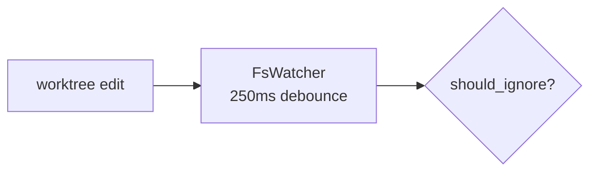
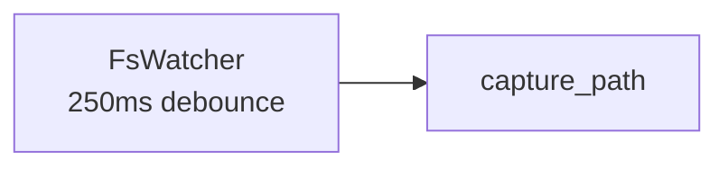

# Authoring mermaid diagrams

Oxplow renders ```mermaid fences in wiki pages and other markdown
through the in-app `MarkdownView`. Renderer is mermaid v11. There is
**no post-write validator** on the user's machine — neither a bun
script nor a Rust parser exists in the runtime — so an invalid
diagram lands silently and only surfaces when the page is opened.
The on-page error is `Mermaid parse error: TypeError: null is not
an object (evaluating 'element.firstChild')`, which is mermaid's
downstream symptom, not a meaningful parser message. **Get it right
at author time.**

## The one rule that prevents 90% of failures

**Quote every shape label.** Inside `[...]`, `{...}`, `(...)`,
`[(...)]`, `[[...]]`, etc., wrap the body in double quotes:



NOT:


Bare labels work *sometimes*. Quoted labels work *always*. There is
no downside to quoting, so quote unconditionally.

## Characters that break unquoted labels

These characters tokenize specially in mermaid and either change the
shape or fail to parse when they appear in a bare `[...]` / `{...}`
body:

- `<br>` / `<br/>` — line break. Bare forms parse in some shapes
  and not others across mermaid versions. Always quote. Inside a
  quoted label, prefer `<br>` (consistently supported across v9-v11).
- `>` — mermaid uses `>label]` as an asymmetric-shape sigil. A bare
  `>` inside a label confuses the lexer.
- `?` — fine inside `{...}` rhombus most of the time but not
  guaranteed. Quote anyway.
- `(`, `)` — bare parens inside `[...]` collide with the
  rounded-shape syntax `(...)`.
- `&`, `;`, `#`, `:` — all reserved in various contexts (links,
  classes, comments). Quote.
- Backticks, single/double quotes inside the label — escape with
  `&quot;` / `&apos;`.

## `>` and `<` inside labels — rephrase, don't escape

Mermaid v11 treats text inside `["..."]` / `{"..."}` as opaque, so a
literal `>` or `<` *parses* fine. The trap is that HTML entities
inside the quoted label render verbatim — `&gt;` shows up as the
five-character string `&gt;`, not as `>`. So:

- DO write `Size{"size > max_file_bytes?"}` if you want a `>` glyph.
- DO NOT write `Size{"size &gt; max_file_bytes?"}` — it parses but
  displays as literal `&gt;`.
- BETTER: rephrase to avoid the ambiguity entirely
  (`Size{"size over max_file_bytes?"}`). Comparison glyphs in
  diagram labels read poorly anyway; a word is usually clearer.

The one exception is `<br>`, which mermaid recognizes as a line
break tag inside quoted labels. Prefer `<br>` over the self-
closing `<br/>` form — both work in v11 today but `<br>` has been
the consistently-supported spelling across versions.

## Edge labels

Edge labels (`A -->|label| B`) don't take quotes — mermaid's pipe
syntax doesn't accept them there. Keep edge labels to plain alnum +
spaces, e.g. `|skip|`, `|keep|`, `|yes|`, `|no|`. If you need
punctuation in an edge label, route the explanation into a node
instead.

## Sequence-diagram messages

Sequence-diagram message labels (after `->>` / `-->>`) DO allow most
punctuation as free text — they read until end-of-line. Still avoid
literal `<`, `>` in message text; HTML-escape them.

```mermaid
sequenceDiagram
  Cap->>Cap: stat → size, oversize?
  alt size &lt;= max_file_bytes
    Cap->>Blob: write(bytes) → sha256
  end
```

## Subgraph titles

`subgraph Name` works; `subgraph "Name with spaces"` works; bare
`subgraph Name with spaces` does NOT. Quote multi-word titles.

## Node IDs vs labels

The ID (`A`, `Filter`, `Cap`) is what mermaid uses internally and
must be `[A-Za-z0-9_]` only — no spaces, no punctuation, no
quotes. The *label* (inside the shape brackets) is the displayed
text and follows the quoting rules above.



## When in doubt: quote it

Quoting is free. If you find yourself wondering "does this label
need quotes" — it does. Quote everything inside `[...]` / `{...}` /
`(...)` and HTML-escape any `>` / `<` inside the quoted body. That
alone eliminates the `firstChild` failure mode.
