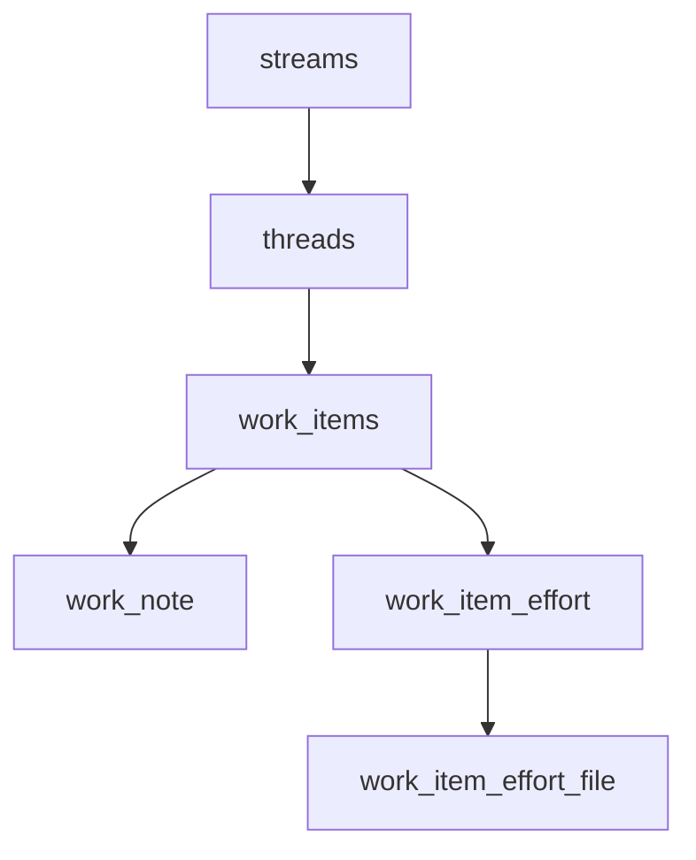
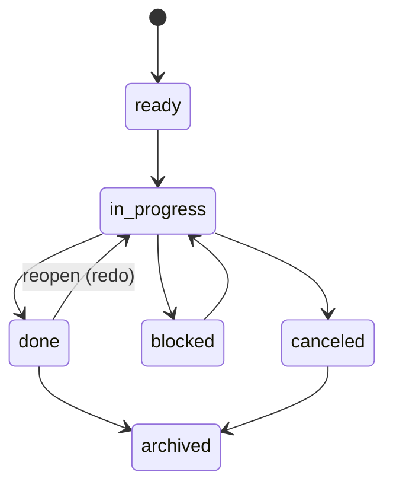
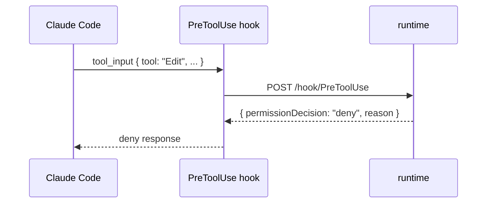
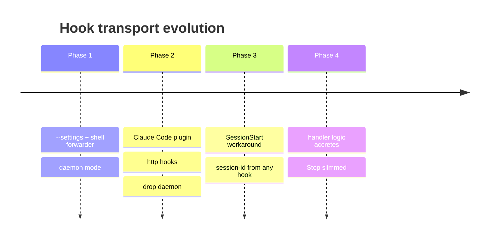

# Wiki pages — exploratory capture

The per-project wiki at `.oxplow/wiki/<slug>.md` is where durable
understanding lives: how subsystems work, why a design landed, the
tradeoffs of an approach, recommendations, comparisons, follow-up
analyses. **It is NOT codebase-only** — any non-trivial exploratory
Q&A belongs here, including general design / process / rationale
discussions. The agent writes it as the user asks questions. Bodies
are markdown files; metadata is synced by a watcher, so you author
with the **Write** tool and call `mcp__oxplow__resync_wiki_page` to pin
freshness.

## When to capture

Capture when **all** are true:

- The user asked an exploratory question — how something works, where
  something lives, why a design choice was made, what the tradeoffs
  are, which approach is better, what the rationale behind X is, etc.
  Both code-flavored and general questions qualify; the wiki is for
  any durable understanding, not just code walkthroughs.
- The answer involved synthesis — pulled together facts, weighed
  options, surfaced reasoning — not just a one-line lookup.
- The synthesis is worth keeping. Trivial restatements aren't.

Skip when:

- You ran edits or commits — those are change events; commits already
  capture them.
- You're asking the user a clarifying question (no answer to capture
  yet — wait for the next turn).
- The exploration was a single-file lookup with no synthesis, or a
  one-line factual answer with no reasoning attached.

If the user types `/note` or says "save this" / "add to the wiki" /
"add a note", capture even if the trigger heuristic above wouldn't
otherwise fire.

## On a read-only thread

The write guard exempts `.oxplow/wiki/<slug>.md` — capture exactly
the same way as on the writer thread. Don't punt the user's
exploration answer just because you can't edit code; the wiki is
where exploration goes regardless of writer status.

## Find before you create

Before writing, search for an existing topic note. Don't fragment.

1. `mcp__oxplow__search_wiki_pages` — title substring (cheap, scan first).
2. `mcp__oxplow__search_wiki_page_bodies` — content substring; catches
   notes that discuss the topic but aren't named after it.
3. `mcp__oxplow__find_wiki_pages_for_file` — for each non-trivial file you
   read this turn, check whether an existing note already references it.

If a clearly-relevant note exists, **append a new dated section** to
it. Only create a new note if no existing note fits.

## Slug + title conventions

- Slug: kebab-case, ≤50 chars, topic-shaped. Examples:
  `stop-hook-pipeline`, `wiki-note-storage`, `work-item-lifecycle`.
- Never include dates or turn ids in the slug — one note per topic.
- Title: `# <Title>` on the first line; human-readable.

## Body shape

```markdown
# <Title>

<one-paragraph overview if the note is new>

## <yyyy-mm-dd> — <focus>

<findings from this turn>

Files referenced: `src/foo.ts`, `src/bar/baz.ts`
```

- Append entries with `## <date> — <focus>` headings.
- Inline file references as **wikilinks** with workspace-relative
  paths AND an explicit `@<version>`. The renderer turns these into
  clickable links that open the file at the pinned version, and the
  parser strips the version to keep backlinks-by-path working.
- Backticks stay reserved for code-ish things (identifiers, types,
  shell commands, config keys) — `EditorPane`, `bun test`,
  `NODE_ENV`. If it's a path the reader should be able to click,
  use a wikilink, not backticks.

### Required: every file wikilink declares a version

A file wikilink is a snapshot of understanding. Without a version
the link is implicitly "whatever's in the working tree right now,"
which silently rots the moment that file changes. **Always pin a
version**, picking explicitly between two cases:

1. **Run `git status --porcelain <path>` first.** (Or, if you read
   the file via Read this turn and saw it was committed cleanly,
   you can skip the porcelain check — but err toward checking.)
2. **If the path is clean** (no working-tree edits), use the
   committed sha: `[[src/foo.ts@<HEAD-7-or-full>]]`. If you don't
   know the sha, use the literal `@HEAD`: `[[src/foo.ts@HEAD]]`.
   That pins the link to the commit that's checked out at note-write
   time (resolves at click time).
3. **If the path is modified, added, or untracked**, use
   `[[src/foo.ts@disk]]`. This explicitly says "the working-tree
   version when this note was written." The reader knows the link
   is local-state-dependent.

Bare `[[path]]` (no `@`) is forbidden in new wiki pages. Existing
notes that use bare paths are tolerated (parser back-fills `@disk`
for legacy compat) but shouldn't be propagated — when you append
to an existing note, write your *new* lines with explicit versions.

Wikilink target shapes:

- `[[src/foo.ts@HEAD]]` — file at HEAD (use this for clean files)
- `[[src/foo.ts@<sha>]]` — file at a specific commit
- `[[src/foo.ts@<branch>]]` — file at the tip of a branch
- `[[src/foo.ts@disk]]` — file as it sits on disk right now
  (use this when the working tree differs from HEAD)
- `[[src/foo.ts@disk:42]]` / `[[src/foo.ts@HEAD:42]]` — version + line
- `[[src/foo.ts@disk|the foo helper]]` — custom display text
- `[[dir:src/components]]` — directory (no version; directories are
  navigation targets, not content snapshots)
- `[[abc1234]]` or `[[git:abc1234]]` — git commit reference
- `[[some-other-note]]` — link to another wiki page by slug

Example: "The drag handler in
[[src/ui/components/Tabs.tsx@disk:88]] calls `onDrop` after
validating the target — currently being modified in this thread,
so we pin to `@disk` until it lands. The committed entry point
[[src/ui/index.tsx@HEAD]] is unchanged. See
[[dir:src/ui/components]] for the rest of that surface."

## Write mechanics

1. Resolve the path: call `mcp__oxplow__get_wiki_page_metadata` (existing
   note) or `mcp__oxplow__list_wiki_pages` and use the returned `path`.
   For a brand-new slug, the path is
   `<projectDir>/.oxplow/wiki/<slug>.md`.
2. Use the **Write** tool to write/replace the file. (For appends to
   an existing note, Read first, then Write the merged body.)
3. Call `mcp__oxplow__resync_wiki_page` with the slug so the freshness
   baseline pins to current HEAD without waiting for the watcher's
   200ms debounce.

## Diagrams — use mermaid

Notes render through `MarkdownView` with mermaid post-processing
enabled, so any ```mermaid fenced block becomes an inline SVG in
NoteTab. **Reach for a diagram whenever the relationship would be
clearer drawn than described.** ASCII art is wasted effort here —
write mermaid instead.

Strong signals that a diagram earns its keep:

- Entity hierarchies, table relationships, module dependencies
  → `graph TD` or `flowchart TD`
- State machines (statuses, lifecycles, transitions)
  → `stateDiagram-v2`
- Time-ordered request/response or event flows between components
  → `sequenceDiagram`
- Phase-by-phase evolution of a system over time
  → `timeline`
- Tabular state-vs-condition matrices that would be wide and ugly
  inline → leave as a markdown table; don't force a diagram

Keep diagrams small (≤ ~12 nodes); split into multiple diagrams under
sub-headings if a single one gets crowded. Always pair the diagram
with a prose sentence that says what to look at — readers skim
captions, not boxes.

### graph TD — hierarchy / relationship



### stateDiagram-v2 — lifecycle



### sequenceDiagram — cross-component flow



### timeline — phase-by-phase evolution



Use mermaid's own syntax docs if you need a less common diagram type
(class, ER, gantt, pie, journey). The ```mermaid fence is the only
gating requirement; everything inside is forwarded to mermaid as-is.

## Folding in Explore findings

If this turn dispatched query subagents (`oxplow__delegate_query` →
`record_query_finding`), call `mcp__oxplow__get_thread_notes` and
incorporate their findings into the wiki page rather than discarding
them. Subagent notes are otherwise invisible — the wiki is where they
become durable.
